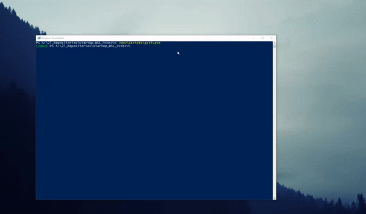

A tiny tool that automates the tedious task of
booting up the vcxsrv, going into your WSL and 
establishing a connection to your server.

**Demo:**  

**Features:**  
-automatically opens up your WSL Ubuntu with a GUI  
-copy and paste between machines is enabled

**Requirements:**  
-Windows 10 build 16215 or later  
-Ubuntu 16.04 or later installed on your WSL  
-xfce4 installed on your Ubuntu WSL  
-vcxsrv installed on your Windows 10 host machine  

**Info:**  
-usage via execution of the startup_wsl_and_vcxsrv.py or the binary.  
-the binary needs to be in the root directory of the project
-all used libs are installed in the bundled venv  
-to access the venv under windows use venv\Scripts\activate
-used libs are listed in the requirements.txt